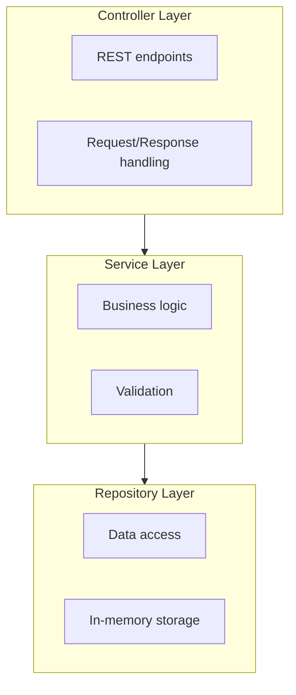
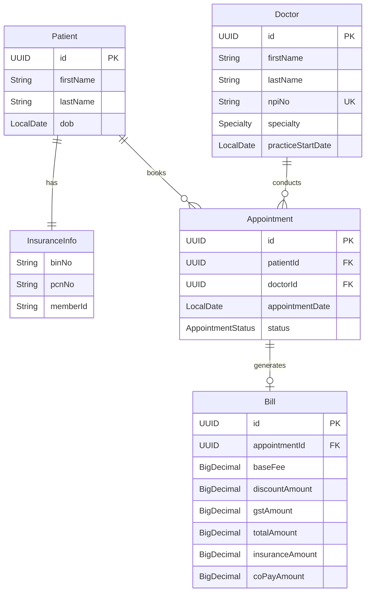
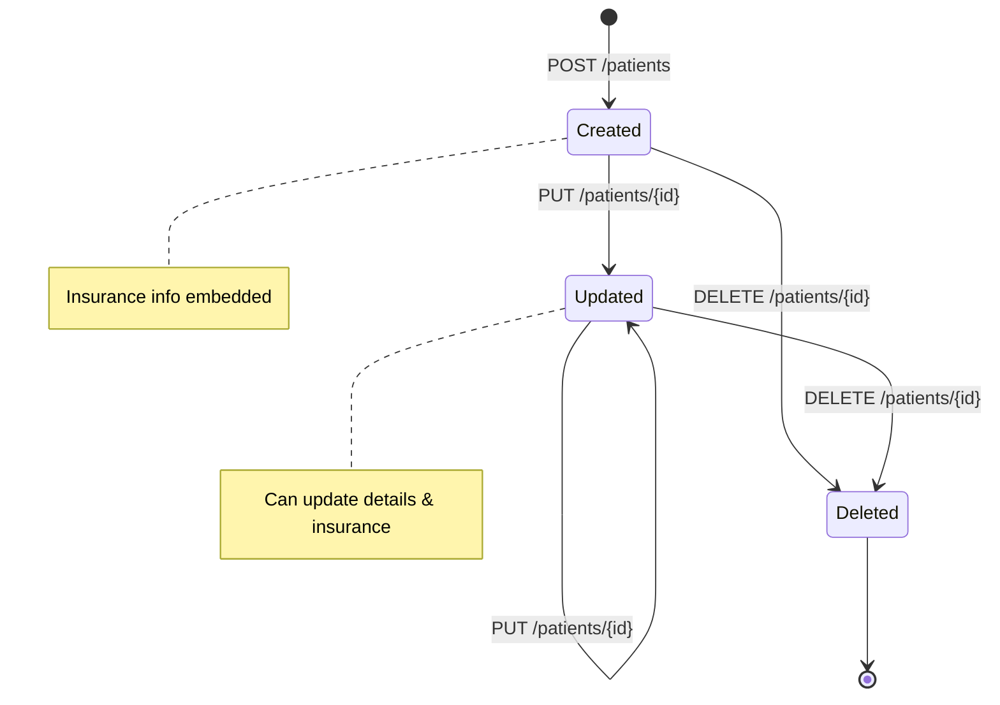
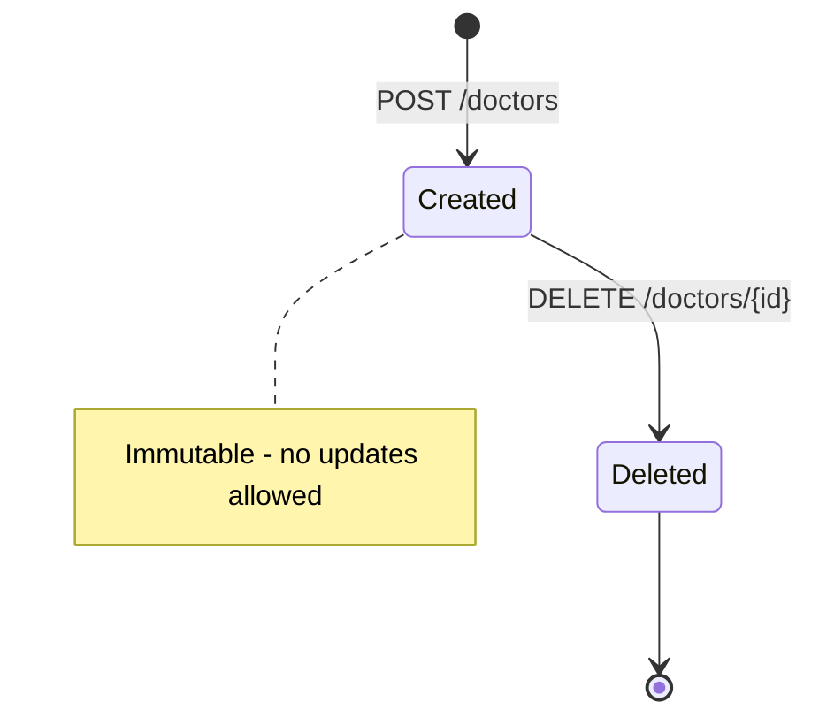
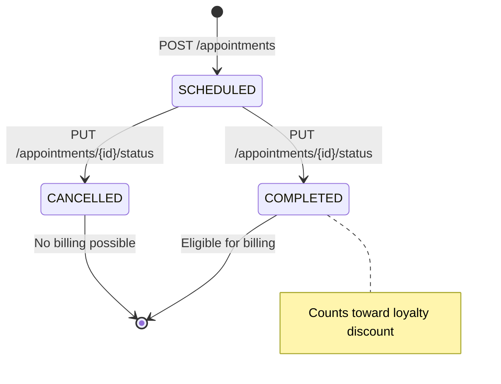
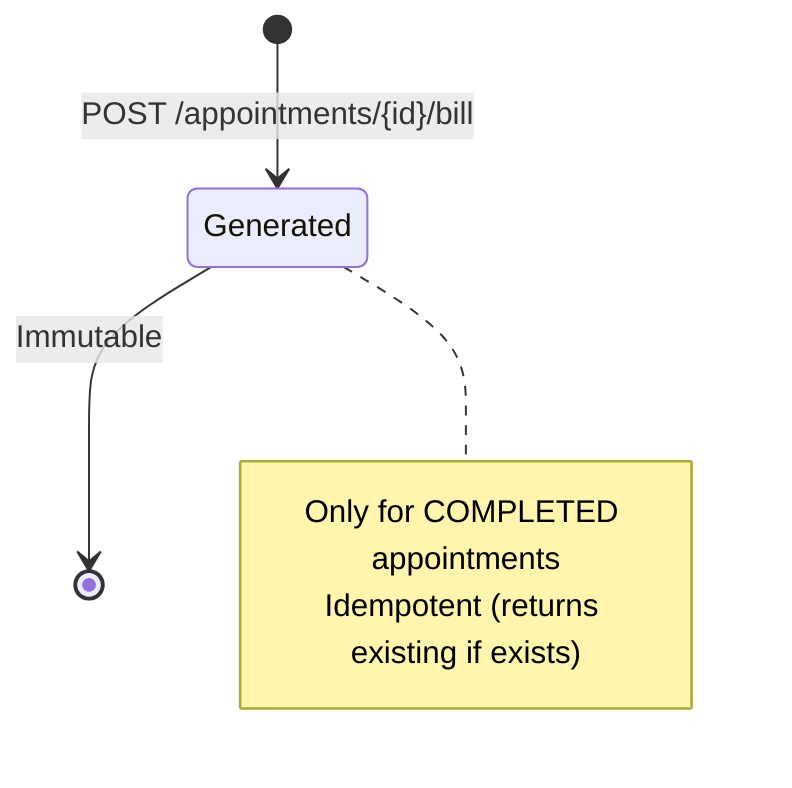
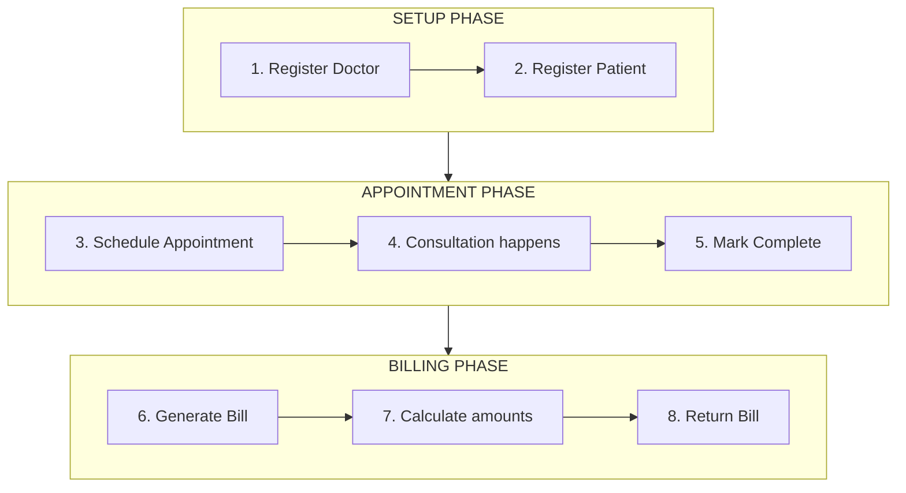
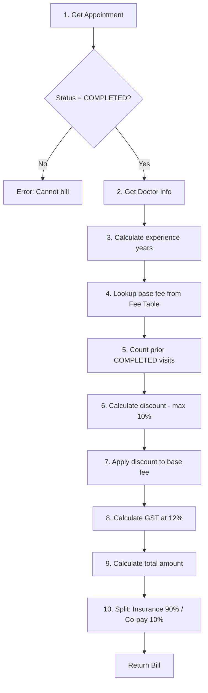

# Architecture Documentation

## System Overview

Healthcare Billing Backend System built with Micronaut 4.10.7 and Kotlin.

## Technology Stack

| Component | Technology | Version |
|-----------|------------|---------|
| Runtime | JDK | 21 (LTS) |
| Language | Kotlin | 1.9.25 |
| Framework | Micronaut | 4.10.7 |
| Build | Gradle (Kotlin DSL) | 8.x |
| Testing | Kotest + MockK | - |

## Package Structure

```
com.linx.health/
├── Application.kt          # Entry point
├── controller/             # REST endpoints
├── service/                # Business logic
├── repository/             # Data access (in-memory)
├── domain/                 # Entity models
├── dto/                    # Request/Response objects
└── exception/              # Custom exceptions
```

## Layer Architecture



## Entity Relationships



## Entity Lifecycles

### Patient Lifecycle



- Patient created with insurance info (required)
- Can update personal details and insurance
- Delete removes patient (appointments may reference)

### Doctor Lifecycle



- Doctor created once with all info
- No updates (NPI, specialty, start date don't change)
- If correction needed: delete and recreate

### Appointment Lifecycle



- Created as SCHEDULED
- Transitions to COMPLETED after consultation
- Can be CANCELLED (no billing possible)
- COMPLETED appointments count toward loyalty discount

### Bill Lifecycle



- Generated only for COMPLETED appointments
- Idempotent: returns existing bill if already generated
- Immutable once created

## Application Workflow

### Typical Consultation Flow



**Workflow Details:**

| Step | Action | API |
|------|--------|-----|
| 1 | Register Doctor | `POST /doctors` |
| 2 | Register Patient with insurance | `POST /patients` |
| 3 | Schedule Appointment | `POST /appointments` → SCHEDULED |
| 4 | Consultation happens | (outside system) |
| 5 | Mark Complete | `PUT /appointments/{id}/status` → COMPLETED |
| 6 | Generate Bill | `POST /appointments/{id}/bill` |
| 7 | System calculates | base fee, discount, GST, insurance split |
| 8 | Return Bill | Bill with all amounts |

### API Endpoints Summary

| Method | Endpoint | Description |
|--------|----------|-------------|
| POST | `/patients` | Create patient with insurance |
| GET | `/patients/{id}` | Get patient details |
| PUT | `/patients/{id}` | Update patient |
| DELETE | `/patients/{id}` | Delete patient |
| POST | `/doctors` | Create doctor |
| GET | `/doctors/{id}` | Get doctor details |
| DELETE | `/doctors/{id}` | Delete doctor |
| POST | `/appointments` | Schedule appointment |
| GET | `/appointments/{id}` | Get appointment details |
| PUT | `/appointments/{id}/status` | Update status |
| POST | `/appointments/{id}/bill` | Generate bill |
| GET | `/bills/{id}` | Get bill details |

## Key Design Decisions

| Decision | Choice | Rationale |
|----------|--------|-----------|
| Storage | In-memory (ConcurrentHashMap) | Per assignment requirement |
| ID Generation | UUID | Globally unique, no collisions |
| Money Type | BigDecimal | Precision for financial calculations |
| Date Format | MM/DD/YYYY (API), LocalDate (internal) | Per assignment requirement |
| Doctor Updates | Not allowed (immutable) | Problem statement says "capture" |
| Insurance Info | Embedded in Patient | Domain clarity, validation grouping |

> 📖 **Detailed reasoning:** See [DESIGN_DECISIONS.md](./DESIGN_DECISIONS.md) for full ADRs with context and alternatives considered.

## Billing Calculation Flow



## Fee Table

| Specialty | 0-19 yrs | 20-30 yrs | 31+ yrs |
|-----------|----------|-----------|---------|
| ORTHO | $800 | $1,000 | $1,500 |
| CARDIO | $1,000 | $1,500 | $2,000 |

> Experience = years since `practiceStartDate`
