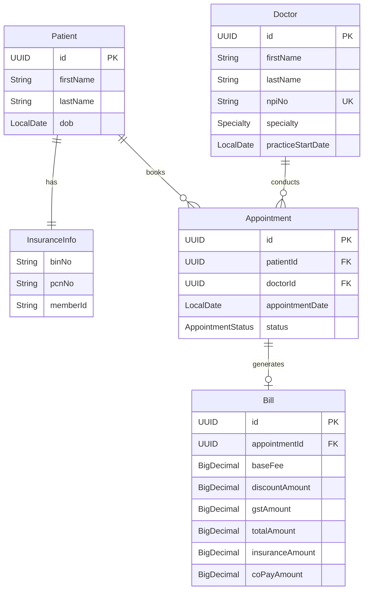

# Architecture Documentation

## System Overview

Healthcare Billing Backend System built with Micronaut 4.10.7 and Kotlin.

## Technology Stack

| Component | Technology | Version |
|-----------|------------|---------|
| Runtime | JDK | 21 (LTS) |
| Language | Kotlin | 1.9.25 |
| Framework | Micronaut | 4.10.7 |
| Build | Gradle (Kotlin DSL) | 8.x |
| Testing | Kotest + MockK | - |

## Package Structure

```
com.linx.health/
├── Application.kt          # Entry point
├── controller/             # REST endpoints
├── service/                # Business logic
├── repository/             # Data access (in-memory)
├── domain/                 # Entity models
├── dto/                    # Request/Response objects
└── exception/              # Custom exceptions
```

## Layer Architecture

```
┌─────────────────────────────────────────────────────────┐
│                    Controller Layer                      │
│         (REST endpoints, request/response handling)      │
└─────────────────────────┬───────────────────────────────┘
                          │
┌─────────────────────────▼───────────────────────────────┐
│                     Service Layer                        │
│              (Business logic, validation)                │
└─────────────────────────┬───────────────────────────────┘
                          │
┌─────────────────────────▼───────────────────────────────┐
│                   Repository Layer                       │
│            (Data access, in-memory storage)              │
└─────────────────────────────────────────────────────────┘
```

## Entity Relationships



## Key Design Decisions

| Decision | Choice | Rationale |
|----------|--------|-----------|
| Storage | In-memory (ConcurrentHashMap) | Per assignment requirement |
| ID Generation | UUID | Globally unique, no collisions |
| Money Type | BigDecimal | Precision for financial calculations |
| Date Format | MM/DD/YYYY (API), LocalDate (internal) | Per assignment requirement |
| Doctor Updates | Not allowed (immutable) | Problem statement says "capture" |

## Billing Calculation Flow

```
1. Get Appointment (must be COMPLETE)
        │
        ▼
2. Get Doctor's specialty and experience
        │
        ▼
3. Lookup base fee from fee table
        │
        ▼
4. Calculate discount (min(priorVisits, 10)%)
        │
        ▼
5. Apply discount to base fee
        │
        ▼
6. Calculate GST (12% of discounted amount)
        │
        ▼
7. Calculate total (discounted + GST)
        │
        ▼
8. Split: Insurance (90%) / Co-pay (10%)
```

## Fee Table

| Specialty | < 20 yrs | 20-30 yrs | 30+ yrs |
|-----------|----------|-----------|---------|
| ORTHO | $800 | $1,000 | $1,500 |
| CARDIO | $1,000 | $1,500 | $2,000 |
